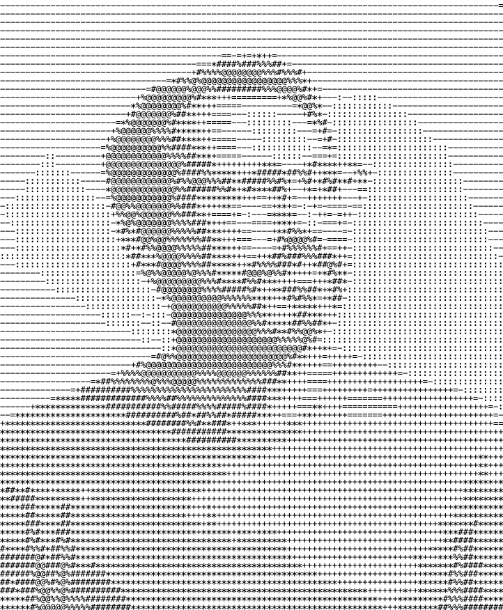

# M/Lab

**Judgment before output.**

M/Lab is a living paper and index for keeping judgment alive in AI-assisted work.

It explores what still needs to happen before asking a machine: seeing, framing, recognizing, tensioning, narrating and arguing.

It is not a prompt library.  
It is not a productivity system.  
It is not a tool showcase.

It is a simple, static website built as a living paper.

---

## Structure

The site is composed of one index page, one paper page, one about page, and six individual Node pages.

```text
index.html
about.html
paper.html
signal.html
invisible.html
insight.html
tension.html
case.html
deck.html
miguel-castro.jpg
```

---

## Pages

### `index.html`

The main entry point.

It presents the six Nodes of M/Lab:

1. Signal
2. Invisible
3. Insight
4. Tension
5. Case
6. Deck

Each Node links to its own page.

---

### `paper.html`

The deeper conceptual layer.

It includes:

- Abstract
- Research Question
- Core Claim
- Contribution
- Definitions
- Framework
- Conceptual Background
- Method
- Limits
- References

This page is designed as a mobile-friendly reading page, without complex tables or heavy layout structures.

---

### `about.html`

The project context.

It explains:

- what M/Lab is;
- what it is not;
- how to read it;
- why it exists;
- who developed it.

The author image is referenced directly from the root:

```html

```

Place the file `miguel-castro.jpg` in the root folder, next to `index.html`.

---

### Node pages

Each Node page follows the same structure:

- Summary
- Risk
- Practice
- Output
- Applied Bite
- Related source
- Back to Index

The Node pages are:

```text
signal.html
invisible.html
insight.html
tension.html
case.html
deck.html
```

---

## Nodes

### Signal

**Before interpretation**

Signal is the discipline of staying with the material before asking it to mean something.

Practice: **Look before interpreting.**

---

### Invisible

**Before normalization becomes truth**

Invisible looks for what stopped looking like a problem because people learned to live with it.

Practice: **Identify what has been normalized.**

---

### Insight

**Before language becomes decoration**

Insight separates observation from recognition.

Practice: **Distinguish observation from recognition.**

---

### Tension

**Before contrast becomes direction**

Tension begins when an insight stops being comfortable and creates friction in real life.

Practice: **Find where the insight creates friction.**

---

### Case

**Before results rewrite the story**

Case protects the idea from being rewritten by its outcome.

Practice: **Reconstruct the idea before the result.**

---

### Deck

**Before structure pretends to be argument**

Deck separates arranging information from building an argument.

Practice: **Turn structure into argument.**

---

## Deployment on GitHub Pages

This is a static HTML site. No build process is required.

To publish it with GitHub Pages:

1. Create a GitHub repository.
2. Upload all files to the root of the repository.
3. Make sure `index.html` is in the root.
4. Add `miguel-castro.jpg` to the root.
5. Go to **Settings** → **Pages**.
6. Under **Build and deployment**, select:
   - Source: `Deploy from a branch`
   - Branch: `main`
   - Folder: `/root`
7. Save.

GitHub Pages will publish the site at:

```text
https://yourusername.github.io/repository-name/
```

---

## Updating the author image

Replace the file:

```text
miguel-castro.jpg
```

The filename must stay the same unless you also update the image reference in `about.html`.

Recommended format:

- JPG
- portrait crop
- 3:4 aspect ratio
- grayscale or neutral image treatment

---

## Editing content

All pages are plain HTML.

To edit a Node, open the corresponding file:

```text
signal.html
invisible.html
insight.html
tension.html
case.html
deck.html
```

To edit the core argument, open:

```text
paper.html
```

To edit project context or author information, open:

```text
about.html
```

---

## Typography

The site uses:

- **Inter** for primary text
- **IBM Plex Mono** for metadata, labels and navigation

Fonts are loaded through Google Fonts.

---

## Design principles

The site is intentionally minimal.

The interface should feel like:

- a living index;
- a reading system;
- a restrained archive;
- a lightweight paper;
- a place to enter thought, not a landing page.

Avoid adding unnecessary visual elements, cards, animations or complex navigation unless they clarify the reading experience.

---

## Author

M/Lab is developed by **Miguel Castro**, a Cannes Lions Grand Prix winner in Innovation and creative director working across creativity, technology and applied systems.

His work focuses on finding what is overlooked before it becomes obvious.

---

## Status

M/Lab is incomplete by design.

It is a living paper, updated through practice.
